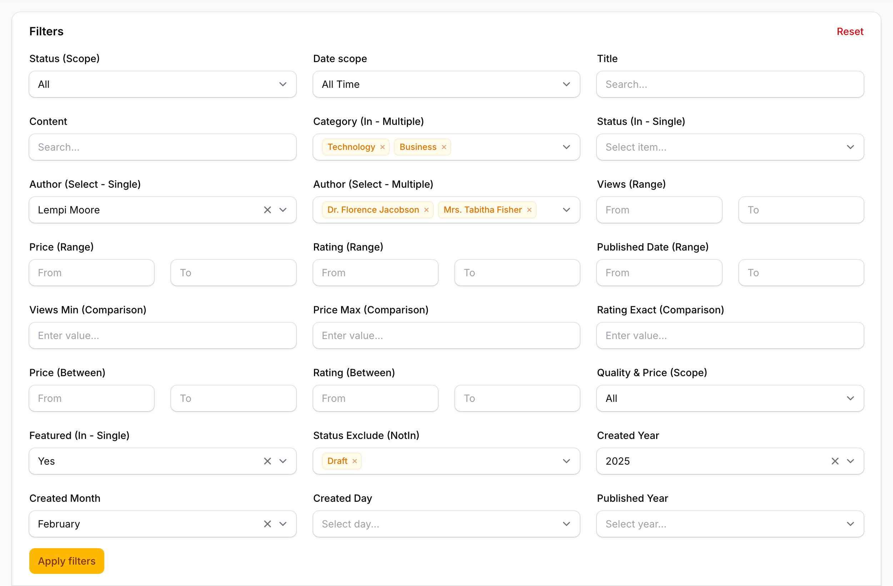

<div align="center">

# Filament Dcat Filters

**Bring Dcat Admin's powerful filter features to Filament**

Built with PHP 8.3+ for Laravel 12 and Filament v4/v5

[](https://packagist.org/packages/cooper/filament-dcat-filters)
[](https://packagist.org/packages/cooper/filament-dcat-filters)
[](https://github.com/myxiaoao/filament-dcat-filters/actions/workflows/run-tests.yml)
[](LICENSE)
[](https://www.php.net)
[](https://laravel.com)
[](https://filamentphp.com)



---

A modern collection of enhanced filters inspired by [Dcat Admin](https://github.com/jqhph/dcat-admin), combining intuitive UI components with powerful filtering capabilities for [Filament](https://filamentphp.com) admin panels.

[English Documentation](#features) | [中文文档](README_CN.md)

</div>

## Features

### Core Filters
- 🎯 **Scope Filter** - Tab-style quick filters for common queries
- 📊 **Range Filter** - Simplified date/number range filtering (3 lines of code!)
- 📅 **Date Component Filter** - Filter by year, month, or day separately
- 🔍 **SelectTable Filter** - Modal table selector with search and pagination
- 🎭 **Modal Select Filter** - Dcat Admin style modal with full table display
- 🔢 **Between Filter** - Numeric range filtering shortcut
- 🙈 **Hidden Filter** - URL parameter-based filtering without UI

### Quick Filters
- ⚡ **LIKE Filter** - Text search with wildcard control (supports NOT LIKE)
- 📋 **IN Filter** - Multiple value selection (supports NOT IN)
- 🔢 **Comparison Filter** - Comparison operators (>, <, >=, <=, =, !=)
- ✅ **Boolean Filter** - True/false/all toggle for boolean fields
- 🔘 **Null Filter** - NULL/NOT NULL value filtering
- 📝 **Enum Filter** - Auto-generate options from PHP 8.1+ Enum classes
- 🔍 **FullText Filter** - Search across multiple fields simultaneously
- 📆 **Relative Date Filter** - Pre-defined date range shortcuts

### Specialized Filters
- 🗄️ **JSON Filter** - Query JSON/JSONB columns with path access
- 🏷️ **FindInSet Filter** - Query comma-separated values using FIND_IN_SET
- 🔤 **Regex Filter** - Pattern matching with regular expressions
- 📱 **InputMask Filter** - Formatted input with masks (phone, credit card, etc.)
- 📍 **GeoLocation Filter** - Geographic proximity filtering with Haversine formula
- 🔗 **Filter Group** - Combine filters with AND/OR logic

### Advanced Features
- 🔄 **Reset All Filters** - One-click reset button for all active filters
- 💾 **Filter State Persistence** - Remember filter states across sessions
- 🔗 **URL Query Parameter Sync** - Shareable filter URLs without page reload
- 🔗 **Cascading Select Filter** - Dynamic dependent dropdowns
- ♿ **Accessibility Support** - ARIA labels and keyboard navigation
- 📋 **Filter Presets** - Save and load filter combinations
- 🔢 **Scope Badge Counts** - Display record counts on scope tabs
- 📤 **Filter Export/Import** - Share filter configurations via URL or JSON

### Additional Features
- 🎨 **Highly Customizable** - Extensive customization options for each filter
- 📱 **Mobile Friendly** - Responsive design for all screen sizes
- 🌐 **Bilingual Docs** - Complete English and Chinese documentation
- ✅ **Fully Tested** - Comprehensive test coverage with 693 tests

## Version Compatibility

| Filament | Filament Dcat Filters | PHP    | Laravel |
|----------|----------------------|--------|---------|
| 5.x      | 1.x                  | ^8.3   | ^12.0   |
| 4.x      | 1.x                  | ^8.3   | ^12.0   |

## Installation

You can install the package via composer:

```bash
composer require cooper/filament-dcat-filters
```

Optionally, you can publish the config file:

```bash
php artisan vendor:publish --tag="filament-dcat-filters-config"
```

Optionally, you can publish the views:

```bash
php artisan vendor:publish --tag="filament-dcat-filters-views"
```

## Quick Start

### Scope Filter

Perfect for quick filtering with tab-style buttons:

```php
use Cooper\FilamentDcatFilters\Filters\ScopeFilter;

ScopeFilter::make('status')
    ->scopes([
        'all' => 'All',
        'active' => 'Active',
        'inactive' => 'Inactive',
    ])
```

**[View detailed documentation →](docs/en/scope-filter.md)**

### Range Filter

Simplified date/number range filtering:

```php
use Cooper\FilamentDcatFilters\Filters\RangeFilter;

RangeFilter::make('created_at')->datetime()
```

**[View detailed documentation →](docs/en/range-filter.md)**

### SelectTable Filter

Modal table selector with search and pagination:

```php
use Cooper\FilamentDcatFilters\Filters\SelectTableFilter;

SelectTableFilter::make('user_id')
    ->relationship('user', 'name')
    ->multiple()
```

**[View detailed documentation →](docs/en/select-table-filter.md)**

### Date Component Filter

Filter by year, month, or day components:

```php
use Cooper\FilamentDcatFilters\Filters\DateComponentFilter;

DateComponentFilter::make('created_at')->year()
DateComponentFilter::make('birth_date')->month()
DateComponentFilter::make('published_at')->day()
```

**[View detailed documentation →](docs/en/date-component-filter.md)**

### Modal Select Filter

Dcat Admin style modal with full table display:

```php
use Cooper\FilamentDcatFilters\Filters\ModalSelectFilter;

ModalSelectFilter::make('user_id')
    ->model(User::class, 'name', 'id')
    ->dialogTitle('Select User')
    ->displayColumns(['id' => 'ID', 'name' => 'Name', 'email' => 'Email'])
    ->searchable(['name', 'email'])
    ->multiple()
```

**[View detailed documentation →](docs/en/modal-select-filter.md)**

### Quick Filters

Built-in filters for common operations:

```php
use Cooper\FilamentDcatFilters\Filters\{LikeFilter, InFilter, ComparisonFilter, BetweenFilter};

// LIKE search (with NOT LIKE support)
LikeFilter::make('title'),
LikeFilter::make('spam_keywords')->notLike(), // Exclude matches

// IN array (with NOT IN support)
InFilter::make('category_id')
    ->options(Category::pluck('name', 'id')->toArray()),
InFilter::make('blocked_users')->notIn(), // Exclude selected

// Comparison (>, <, =, >=, <=, !=)
ComparisonFilter::make('views')->gte()->label('Minimum Views'),

// Between (numeric range)
BetweenFilter::make('price')->label('Price Range'),
```

**[View detailed documentation →](docs/en/quick-filters.md)**

### Boolean Filter

Dedicated true/false/all toggle for boolean fields:

```php
use Cooper\FilamentDcatFilters\Filters\BooleanFilter;

BooleanFilter::make('is_active')
    ->label('Status')
    ->trueLabel('Active')
    ->falseLabel('Inactive')

// Quick presets
BooleanFilter::active()      // is_active field
BooleanFilter::published()   // is_published field
BooleanFilter::enabled()     // is_enabled field
```

### Null Filter

Filter for NULL or NOT NULL values:

```php
use Cooper\FilamentDcatFilters\Filters\NullFilter;

NullFilter::make('deleted_at')
    ->nullLabel('Not Deleted')
    ->notNullLabel('Deleted')

// Quick presets
NullFilter::deleted()    // deleted_at field
NullFilter::assigned()   // Check if field is assigned
NullFilter::empty()      // Check if field is empty/filled
```

### Enum Filter

Auto-generate options from PHP 8.1+ Enum classes:

```php
use Cooper\FilamentDcatFilters\Filters\EnumFilter;

EnumFilter::make('status')
    ->enum(OrderStatus::class)
    ->multiple()
    ->exclude([OrderStatus::Cancelled])
```

### FullText Filter

Search across multiple fields simultaneously:

```php
use Cooper\FilamentDcatFilters\Filters\FullTextFilter;

FullTextFilter::make('search')
    ->searchIn(['name', 'email', 'phone'])
    ->placeholder('Search users...')
    ->minLength(2)
    ->debounce(300)
```

### Relative Date Filter

Pre-defined date range shortcuts:

```php
use Cooper\FilamentDcatFilters\Filters\RelativeDateFilter;

RelativeDateFilter::make('created_at')
    ->only(['today', 'yesterday', 'last_7_days', 'last_30_days', 'this_month'])

// Quick presets
RelativeDateFilter::common()     // Common date ranges
RelativeDateFilter::weekly()     // Week/month focused
RelativeDateFilter::reporting()  // Quarter/year focused
```

### Hidden Filter

URL parameter-based filtering (no UI):

```php
use Cooper\FilamentDcatFilters\Filters\HiddenFilter;

// Pre-filter by tenant
HiddenFilter::make('tenant_id')
    ->default(auth()->user()->tenant_id)
    ->eq()
```

**[View detailed documentation →](docs/en/advanced-features.md#hiddenfilter-usage-guide)**

### Reset All Filters

Add a one-click reset button:

```php
use Cooper\FilamentDcatFilters\Concerns\HasResetFilters;

class ListUsers extends ListRecords
{
    use HasResetFilters;

    protected function getHeaderActions(): array
    {
        return [
            $this->getResetFiltersAction(),
        ];
    }
}
```

**[View detailed documentation →](docs/en/reset-filters.md)**

### Filter State Persistence

Remember filter states across sessions:

```php
use Cooper\FilamentDcatFilters\Concerns\HasFilterPersistence;

class ListUsers extends ListRecords
{
    use HasFilterPersistence;

    protected string $filterPersistenceKey = 'users-list-filters';
}
```

**[View detailed documentation →](docs/en/filter-persistence.md)**

### URL Query Parameter Sync

Shareable filter URLs:

```php
use Cooper\FilamentDcatFilters\Concerns\SyncsFiltersToUrlWithoutHistory;

class ListUsers extends ListRecords
{
    use SyncsFiltersToUrlWithoutHistory;
}
```

**[View detailed documentation →](docs/en/url-sync.md)**

### Cascading Select Filter

Dynamic dependent dropdowns:

```php
use Cooper\FilamentDcatFilters\Filters\CascadingSelectFilter;

CascadingSelectFilter::make('location')
    ->levels([
        'country' => [
            'label' => 'Country',
            'options' => fn () => Country::pluck('name', 'id'),
        ],
        'state' => [
            'label' => 'State',
            'options' => fn ($country) => State::where('country_id', $country)->pluck('name', 'id'),
            'dependsOn' => 'country',
        ],
        'city' => [
            'label' => 'City',
            'options' => fn ($state) => City::where('state_id', $state)->pluck('name', 'id'),
            'dependsOn' => 'state',
        ],
    ])
```

**[View detailed documentation →](docs/en/cascading-filters.md)**

## Documentation

### Core Filters
- 📖 [Scope Filter](docs/en/scope-filter.md) - Tab-style quick filters
- 📖 [Range Filter](docs/en/range-filter.md) - Date/number range filtering
- 📖 [Date Component Filter](docs/en/date-component-filter.md) - Year/Month/Day filtering
- 📖 [SelectTable Filter](docs/en/select-table-filter.md) - Modal table selector
- 📖 [Modal Select Filter](docs/en/modal-select-filter.md) - Dcat Admin style modal table selector
- 📖 [Quick Filters](docs/en/quick-filters.md) - LIKE, IN, GT, LT, BETWEEN filters

### Specialized Filters
- 📖 [JSON Filter](docs/en/json-filter.md) - Query JSON/JSONB columns with path access
- 📖 [FindInSet Filter](docs/en/find-in-set-filter.md) - Query comma-separated values
- 📖 [Regex Filter](docs/en/regex-filter.md) - Pattern matching with regular expressions
- 📖 [InputMask Filter](docs/en/input-mask-filter.md) - Formatted input with masks
- 📖 [GeoLocation Filter](docs/en/geo-location-filter.md) - Geographic proximity filtering
- 📖 [Filter Group](docs/en/filter-group.md) - Combine filters with AND/OR logic

### Advanced Features
- 📖 [Reset All Filters](docs/en/reset-filters.md) - One-click reset functionality
- 📖 [Filter State Persistence](docs/en/filter-persistence.md) - Session-based filter memory
- 📖 [URL Query Parameter Sync](docs/en/url-sync.md) - Shareable filter URLs
- 📖 [Cascading Select Filter](docs/en/cascading-filters.md) - Dynamic dependent dropdowns
- 📖 [Accessibility](docs/en/accessibility.md) - ARIA labels and keyboard support
- 📖 [Advanced Features](docs/en/advanced-features.md) - API support, Hidden filters
- 📖 [Concerns (Traits)](docs/en/concerns-traits.md) - Filter presets, badge counts, export/import

### Guides & References
- 📖 [Usage Examples](docs/en/usage-example.md) - Complete working examples
- 📖 [Demo Guide](docs/en/demo-guide.md) - Interactive demonstrations
- 📖 [Comparison with Dcat Admin](docs/en/comparison.md) - Feature comparison
- 📖 [Package Structure](docs/en/package-structure.md) - Package architecture
- 📖 [Documentation Structure](docs/en/documentation-structure.md) - Documentation organization
- 📖 [Future Improvements](docs/en/future-improvements.md) - Roadmap and planned features

## Facade Usage

You can also use the Facade for quick access:

```php
use Cooper\FilamentDcatFilters\Facades\FilamentDcatFilters;

FilamentDcatFilters::scopeFilter('status')->scopes([...]);
FilamentDcatFilters::rangeFilter('created_at')->datetime();

// All available filter shortcuts
FilamentDcatFilters::booleanFilter('is_active');
FilamentDcatFilters::nullFilter('deleted_at');
FilamentDcatFilters::enumFilter('status');
FilamentDcatFilters::fullTextFilter('search');
FilamentDcatFilters::hiddenFilter('tenant_id');
FilamentDcatFilters::filterGroup('combined');
```

## Artisan Command

Generate a custom filter class using the Artisan command:

```bash
php artisan make:dcat-filter MyCustom
```

This creates `app/Filament/Filters/MyCustomFilter.php`.

### Options

| Option | Description | Default |
|--------|-------------|---------|
| `--type` | Filter type to extend | `basic` |
| `--force` | Overwrite existing file | `false` |

### Available Types

| Type | Base Class |
|------|-----------|
| `basic` | `Filament\Tables\Filters\Filter` |
| `like` | `LikeFilter` |
| `in` | `InFilter` |
| `comparison` | `ComparisonFilter` |
| `boolean` | `BooleanFilter` |
| `null` | `NullFilter` |
| `enum` | `EnumFilter` |
| `range` | `RangeFilter` |
| `between` | `BetweenFilter` |
| `scope` | `ScopeFilter` |
| `regex` | `RegexFilter` |
| `fulltext` | `FullTextFilter` |
| `json` | `JsonFilter` |
| `date-component` | `DateComponentFilter` |
| `select-table` | `SelectTableFilter` |
| `modal-select` | `ModalSelectFilter` |
| `hidden` | `HiddenFilter` |
| `relative-date` | `RelativeDateFilter` |
| `cascading-select` | `CascadingSelectFilter` |
| `find-in-set` | `FindInSetFilter` |
| `input-mask` | `InputMaskFilter` |
| `geo-location` | `GeoLocationFilter` |
| `filter-group` | `FilterGroup` |

### Examples

```bash
# Create a basic filter
php artisan make:dcat-filter ProductStatus

# Create a filter extending LikeFilter
php artisan make:dcat-filter ProductSearch --type=like

# Create a filter extending ComparisonFilter
php artisan make:dcat-filter MinPrice --type=comparison

# Overwrite existing
php artisan make:dcat-filter ProductStatus --force
```

## Testing

```bash
composer test
```

## Code Quality

```bash
# Format code
composer format

# Static analysis
composer analyse
```

## Changelog

Please see [CHANGELOG](CHANGELOG.md) for more information on what has changed recently.

## Contributing

Please see [CONTRIBUTING](CONTRIBUTING.md) for details.

## Security Vulnerabilities

If you discover any security-related issues, please email `myxiaoao@gmail.com`.

## Credits

- [Cooper](https://github.com/myxiaoao)
- Inspired by [Dcat Admin](https://github.com/jqhph/dcat-admin)
- [All Contributors](../../contributors)

## License

The MIT License (MIT). Please see [License File](LICENSE) for more information.
